<div align="center">

# 🚀 Backend Learning Journey

**Building strong backend fundamentals → Creating real-world systems → Teaching backend concepts**


</div>

---

## 📌 Overview

This repository represents my **backend development journey** — starting from scratch and progressing toward building scalable, production-ready applications.

It is the **foundation layer** where I implemented and understood all core backend concepts before moving to advanced projects.

---

## 🧭 Learning Roadmap

```mermaid
graph LR
    A[🟢 Backend Basics] --> B[🗄️ Database & Models]
    B --> C[🌐 API Development]
    C --> D[🏗️ Pro Backend Structure]
    D --> E[🚀 YouTube Backend]
    E --> F[🎓 Backend Bootcamp]

    style A fill:#d4edda,stroke:#28a745,color:#155724
    style B fill:#d4edda,stroke:#28a745,color:#155724
    style C fill:#d4edda,stroke:#28a745,color:#155724
    style D fill:#cce5ff,stroke:#004085,color:#004085
    style E fill:#fff3cd,stroke:#856404,color:#856404
    style F fill:#fff3cd,stroke:#856404,color:#856404
```



---

## 🧠 What This Repository Covers

### ⚙️ Core Backend Concepts
- Client-Server Architecture
- Request-Response Cycle
- REST API Design Principles

### 🌐 Server & Routing

```js
// Express server setup
const app = express();

app.get('/users', getAllUsers);
app.post('/users', createUser);
app.put('/users/:id', updateUser);
app.delete('/users/:id', deleteUser);
```

### 🔄 Middleware

Middleware acts as a bridge between **request** and **response**.

```js
// Custom middleware example
const authMiddleware = (req, res, next) => {
  // authentication logic
  next();
};
```

- Custom middleware
- Authentication flow basics
- Error handling

### 🗄️ Database Integration

```js
// MongoDB connection
mongoose.connect(process.env.MONGO_URI)
  .then(() => console.log('DB connected'))
  .catch((err) => console.error(err));
```

- MongoDB connection
- Mongoose usage
- Schema & model design

### 📦 CRUD Operations

| Operation | Method | Description |
|-----------|--------|-------------|
| Create    | POST   | Add new resource |
| Read      | GET    | Fetch resource(s) |
| Update    | PUT    | Modify existing resource |
| Delete    | DELETE | Remove resource |

---

## 🏗️ Project Structure

```
backend-learning/
│
├── 01-deploy-backend-code
├── 02-connect-backend-with-frontend
├── 03-data-modelling-with-mongoose
├── 04-data-modelling-projects
├── 05-professional-backend-setup
├── 06-database-connection
│
└── src/
    ├── controllers/
    ├── routes/
    ├── models/
    ├── middlewares/
    └── utils/
```

---

## 🔥 What's Built on Top of This Repo

### 🚀 YouTube Backend Project

After mastering these concepts, I built a full production backend system:

| Feature | Details |
|---------|---------|
| 🔐 Auth | JWT — access & refresh tokens |
| 📹 Upload | Multer + Cloudinary integration |
| 💬 Social | Comments, likes, subscriptions |
| 🎵 Content | Playlist & dashboard system |
| 📈 Scale | Clean, scalable architecture |

### 🎓 Backend Bootcamp

After building real-world projects, I structured and explained backend concepts as a bootcamp:

- ✅ Backend fundamentals from scratch
- ✅ Real-world architecture patterns
- ✅ Best practices & code quality
- ✅ Interview-focused backend concepts

---

## ⚙️ Tech Stack

| Technology | Purpose |
|------------|---------|
| Node.js | JavaScript runtime |
| Express.js | Server & routing |
| MongoDB | NoSQL database |
| Mongoose | ODM for MongoDB |
| dotenv | Environment management |
| Nodemon | Development server |

---

## 🛠️ Setup & Installation

```bash
git clone https://github.com/iamanu26/backend-learning.git
cd backend-learning
npm install
npm run dev
```

---

## 📈 Learning Outcomes

- ✅ Strong backend fundamentals
- ✅ Clear understanding of APIs
- ✅ Database design thinking
- ✅ Scalable project structuring
- ✅ Confidence to build production-level backends

---

## 💡 The Journey in One Line

> **This repo is where I learned backend. The YouTube backend is where I applied it. The Bootcamp is where I taught it.**

---

## 🧑‍💻 Author

**Anurag Dubey** — [github.com/iamanu26](https://github.com/iamanu26)

---

<div align="center">

⭐ Star it &nbsp;·&nbsp; 🍴 Fork it &nbsp;·&nbsp; 📢 Share it

</div>
